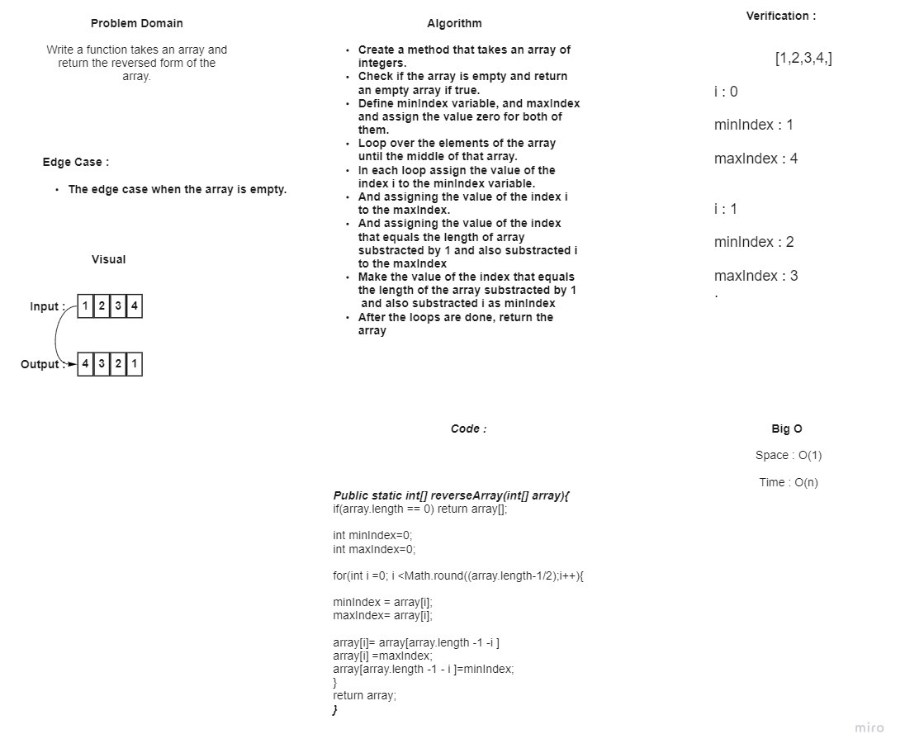

# Reverse an Array

### *Creating a function called "reverseArray" which takes an array as an argument, and return an array with elements in reversed order.*

## Whiteboard Process



## Approach & Efficiency
### *Iterate with for loop until to the "array.length/2", Then swapping first with last element in array then second with before last element and so on until loop stop and get array in reverse order.*
```
Big O :
 Space : O(1)
 Time : O(n)
```