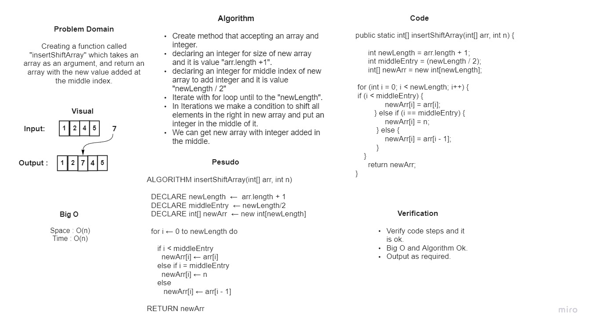

# Reverse an Array

### *Creating a function called "insertShiftArray" which takes an array as an argument, and return an array with the new value added at the middle index.*

## Whiteboard Process



## Approach & Efficiency
### *Iterate with for loop until to the "arr.length + 1", Then adding an integer in the middle of new array then shift all elements in the right of middle index to the right in same new array.*
```
Big O :
 Space : O(n)
 Time : O(n)
```