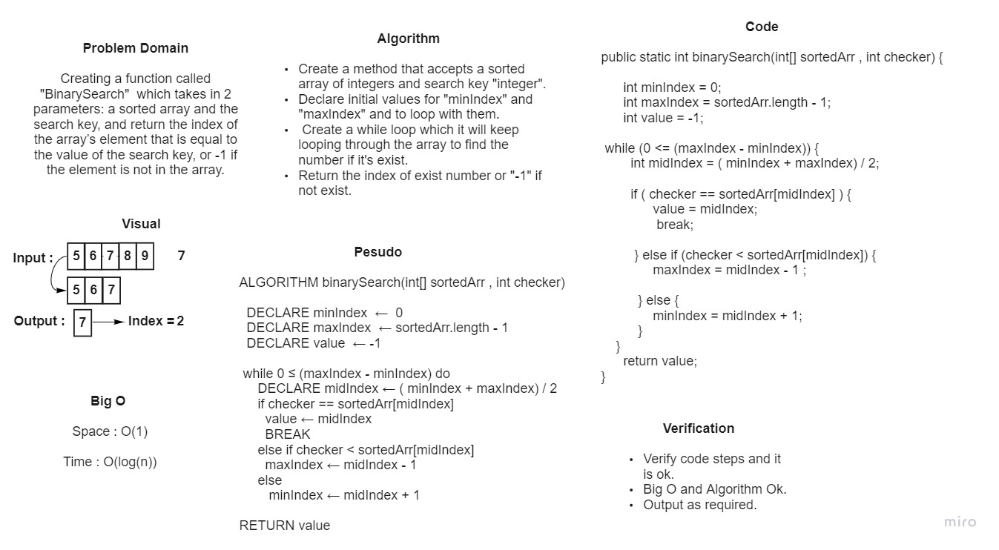

# Binary Search of Sorted Array

### *Creating a function called "BinarySearch"  which takes in 2 parameters: a sorted array and the search key, and return the index of the array’s element that is equal to the value of the search key, or "-1" if the element is not in the array.*

## Whiteboard Process



## Approach & Efficiency
### *Iterate inside while loop with if statements to check if the key available or not until find it or return "-1" if the element is not in the array*
```
Big O :
 Space : O(1)
 Time : log(n)
```