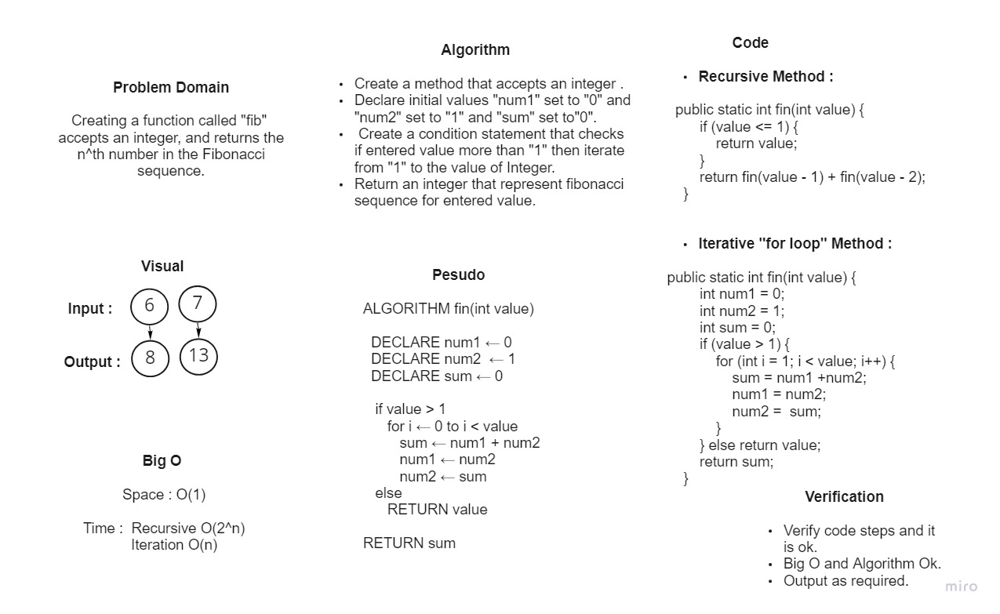

# Fibonacci Sequence

### *Creating a function called "fib"  accepts an integer, and returns the n^th number in the Fibonacci sequence.*

## Whiteboard Process



## Approach & Efficiency
### *Create a condition statement that checks if entered value more than "1" then iterate from "1" to the value of Integer, Return an integer that represent fibonacci sequence for entered value.*
```
Big O :
 Space : O(1)
 Time :  Recursive O(2^n)
         Iteration O(n)
```