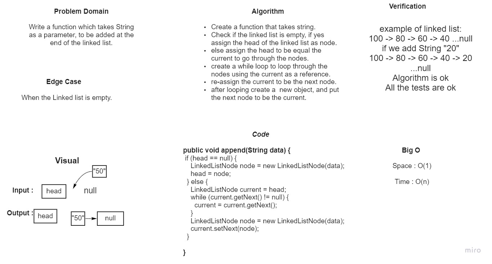
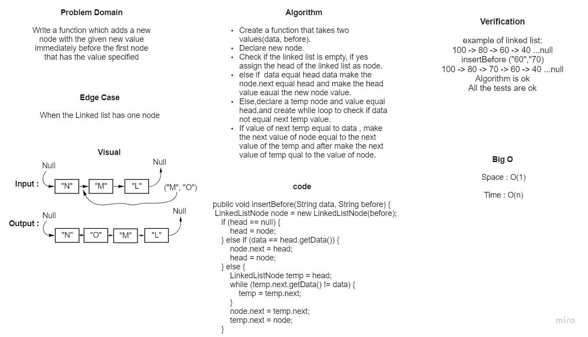
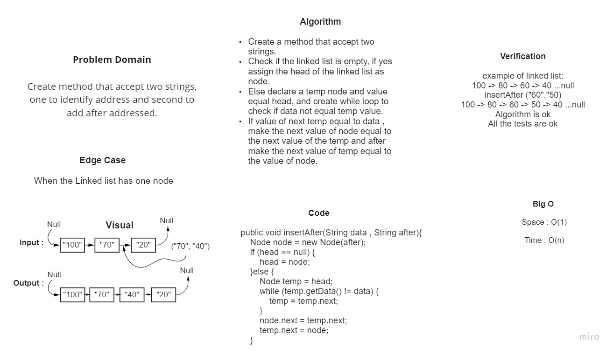

# 5.Singly Linked List
Singly linked lists contain nodes which have a data field as well as 'next' field, which points to the next node in line of nodes.
## Challenge And API
1. A Node class that has properties for the value stored in the Node, and a pointer to the next Node.
2. LinkedLink Class, that contains:
- A head property.
- Insert method -> Adds a new node In the beginning of the LinkedList.
- Includes method -> Indicates whether that value exists as a Node's value somewhere within the list.
- to string -> Returns: a string representing all the values in the Linked List, formatted as:
  "{ a } -> { b } -> { c } -> NULL"
## Approach & Efficiency :
- I used while loops in each method which takes space : O(1) and time: O(n).

------------------------------------------------------------------------------------------------------------------------

# 6.Linked List Insertions

This challenge has three tasks:

1. **Append**: Adds a new node with the given value to the end of the list.

2. **Insert before**: Adds a new node with the given new value immediately before the first node that has the value specified.

3. **Insert after**: Adds a new node with the given new value immediately after the first node that has the value specified.

## Whiteboard Process

### Append 

### Insert before

### Insert after

## Approach & Efficiency :
- I used while loops in each method which takes space : O(1) and time: O(n).

-------------------------------------------------------------------------------------------------------------------------