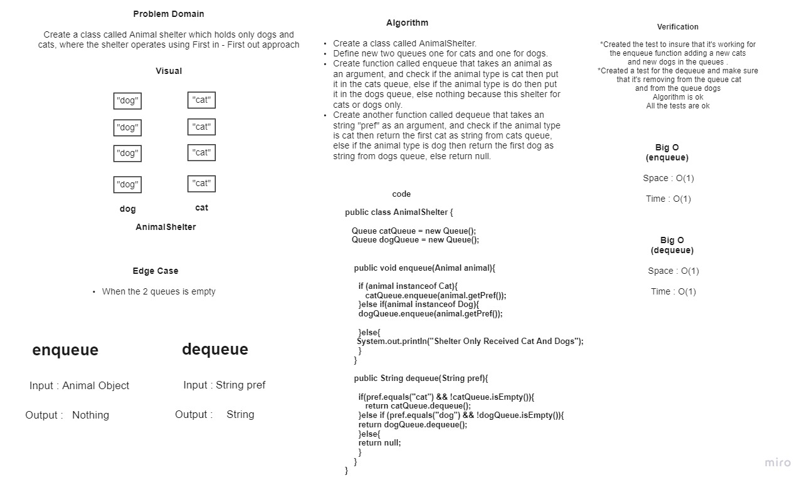

# **10.Stacks and Queues**

* **Stack** is a linear data structure in which elements can be inserted and deleted only from one side of the list, called the top. A stack follows the *LIFO* (Last In First Out) principle.The insertion of an element into stack is called ***push*** operation, and deletion of an element from the stack is called ***pop*** operation.

* **Queue** is a linear data structure in which elements can be inserted only from one side of the list called rear, and the elements can be deleted only from the other side called the front. The queue data structure follows the FIFO (First In First Out) principle.The insertion of an element in a queue is called an ***enqueue*** operation and the deletion of an element is called a ***dequeue*** operation.

## **Challenge**

*This challenge about how to build and using the **Stack** and **Queue** to store nodes in it and also how to apply methods on it like *push* method to delete node in stack and *dequeue* to delete node in queue.*

## **Approach & Efficiency**

### Space: O(1)

### Time: O(1)

## **API**

###  Methods in Stack

* ` push(int value)` : To add new node in the stack.

* `pop()`: Removes the node from the top of the stack.

* `peek()` : Returns Value of the node located at the top of the stack.

* `isEmpty()` : Boolean indicating whether or not the stack is empty.

###  Methods in Queue

* `enqueue(int value)`: To add new node in the queue.

* `dequeue()` : Removes the node from the front of the queue.

* `peek()`  : Returns Value of the node located at the front of the queue.

* `isEmpty()` : Boolean indicating whether or not the queue is empty.

-------------------------------------------------------------------------------------------------------------

# **11.Stack-Queue Pseudo**

# **Challenge Summary**

- Implement a queue by using two stacks
- Create 2Methods:
   1. enqueue : Inserts value into the PseudoQueue, using a first-in, first-out approach.
   2. dequeue : Extracts a value from the PseudoQueue, using a first-in, first-out approach.
## **Whiteboard Process**

## **Approach & Efficiency**

- **Enqueue** 

 **Space: O(1)**

 **Time: O(1)**

- **Dequeue**

 **Space: O(1)**

 **Time: O(n)**
 
------------------------------------------------------------------------------------------------------------

# **12.Stack-Queue Animal-Shelter**

## **Challenge Summary**

- Create an AnimalShelter class that contains two queues the first one for cats and the second one for dogs. Also adds to the queues or removes from queues based on the pref type.

### **Methods**

* `enqueue(Animal animal)`: This method accepts A Animal parameter. It has if-else if- else statement to check the type of the animal to determine which queue it should add to.

* `dequeue(String pref)`: This method accepts a String parameter and return Animal value. It has if-else if- else statement to compare the string parameter with the specific word to direct the removal process in which queue.
## **Whiteboard Process**

## **Approach & Efficiency**

- **Enqueue** 

 **Space: O(1)**

 **Time: O(1)**

- **Dequeue**

 **Space: O(1)**

 **Time: O(1)**
 
