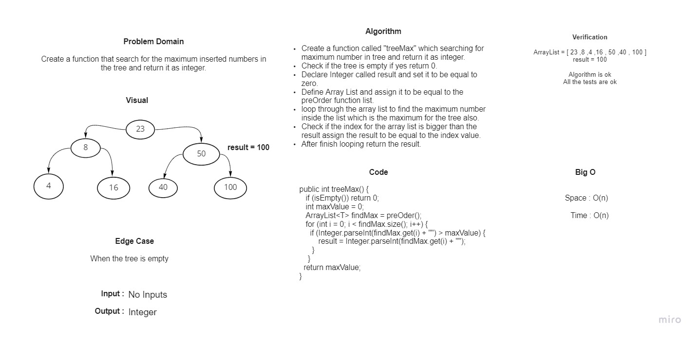

# **15.Trees**

* **A Tree** is a non-linear data structure where data objects are generally organized in terms of hierarchical relationship. The structure is non-linear in the sense that, unlike Arrays, Linked Lists, Stack and Queues, data in a tree is not organized linearly.

* **A binary tree** is a recursive tree data structure where each node can have 2 children at most.

## **Challenge**

- Create a Node class that has properties for the value stored in the node, the left child node, and the right child node.
- Create a Binary Tree class :
  - Define a method for each of the depth first traversals :
    * pre order
    * in order
    * post order
 
    Which returns an array of the values, ordered appropriately.

- Create a Binary Search Tree class
with the following additional methods:
  - Add
    
    Adds a new node with that value in the correct location in the binary search tree.

  - Contains

    Returns: boolean indicating whether or not the value is in the tree at least once.

## **Approach & Efficiency**

### **1. Binary Trees**

- The Big O time complexity for inserting a new node and Searching is O(n).

- The Big O space complexity for a node insertion using breadth first insertion will be O(w), where w is the largest width of the tree.

### **2. Binary Search Trees**

- The Big O time complexity of a Binary Search Tree’s insertion and search operations is O(h), or O(height). 

- The Big O space complexity of a BST search would be O(1).

## **API**

- In **Binary Tree** class we have 3 traversals methods, return an array of the values, ordered appropriately.

  1. pre order
  2. in order
  3. post order. 

- In **Binary Search Tree** class we have 2 methods:

  **1. Add**  
    - Arguments: value  
    - Return: nothing  
      Adds a new node with that value in the correct location in the binary search tree.
     
  **2. Contains**  
    - Argument: value  
    - Returns: boolean indicating whether or not the value is in the tree at least once.

-------------------------------------------------------------------------------------------------------------

# **16.Tree Max**

## **Challenge Summary**

- We asked to write a method that finds the maximum numeric value stored in the binary tree.
  * Method: **treeMax()**
  * Arguments: none
  * Returns: number

## **Whiteboard Process**

## **Approach & Efficiency**

- **Space: O(n)**

- **Time: O(n)**

