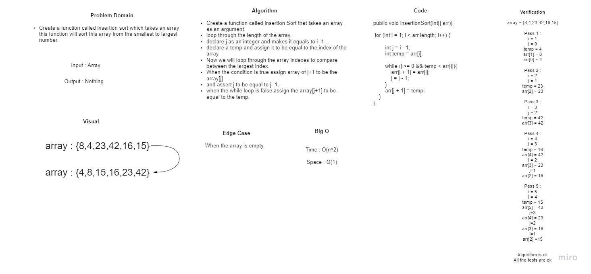
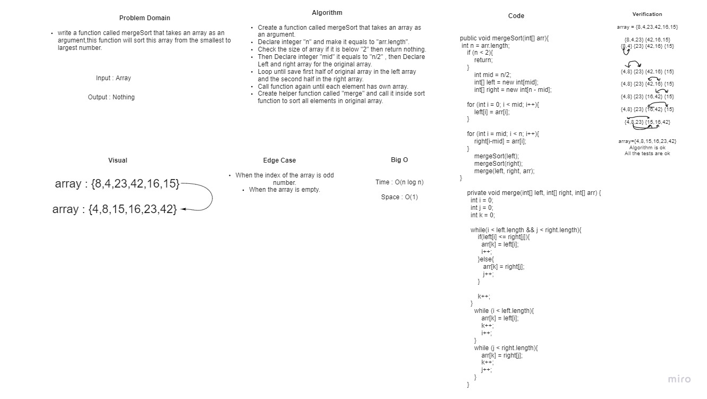
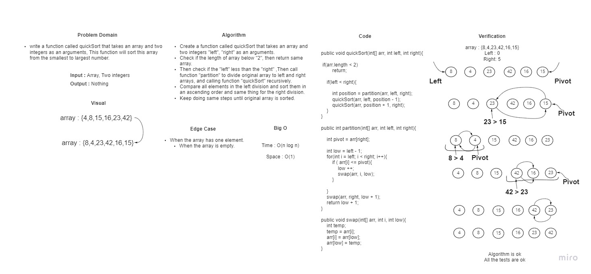

# **Code Challenge 26: Insertion Sort**

# **Challenge Summary**

This challenge relates to creating a method called `insartionSort (int [] arr) ` that takes an int array as a parameter. The purpose of this method is to sort an unsorted array in ascending order.

## **Whiteboard Process**

## **Approach & Efficiency**

- Time : O(n^2)

- Space : O(1)

-------------------------------------------------------------------------------------------------------------

# **Code Challenge 27: Merge Sort**

# **Challenge Summary**

This challenge relates to creating a method called mergeSort (int [] arr) that takes an int array as a parameter. The method divides the array into two parts and each part is also divided into two parts until breaking each element into a single part.
Then sort the elements from smallest to largest and merge the divided sorted array together. In the end, the array has been sorted.

## **Whiteboard Process**

## **Approach & Efficiency**

- Time : O(nlog(n))

- Space : O(n)

-------------------------------------------------------------------------------------------------------------

# **Code Challenge 28: Quick Sort**

# **Challenge Summary**

quicksort algorithm repeatedly divides an un-sorted section into a lower order sub-section and a higher order sub-section by comparing to a pivot element. At the end of recursion, we get sorted array.

## **Whiteboard Process**

## **Approach & Efficiency**

- Time : O(nlog(n))

- Space : O(1)
