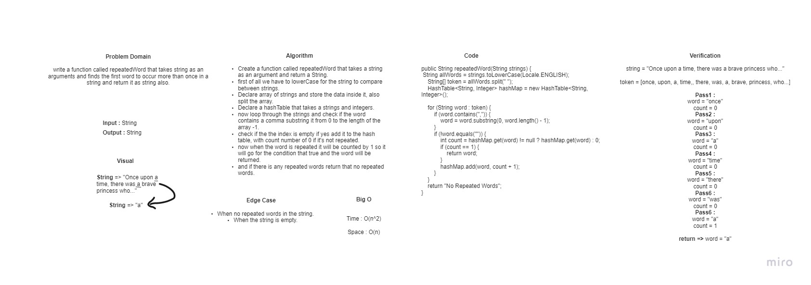
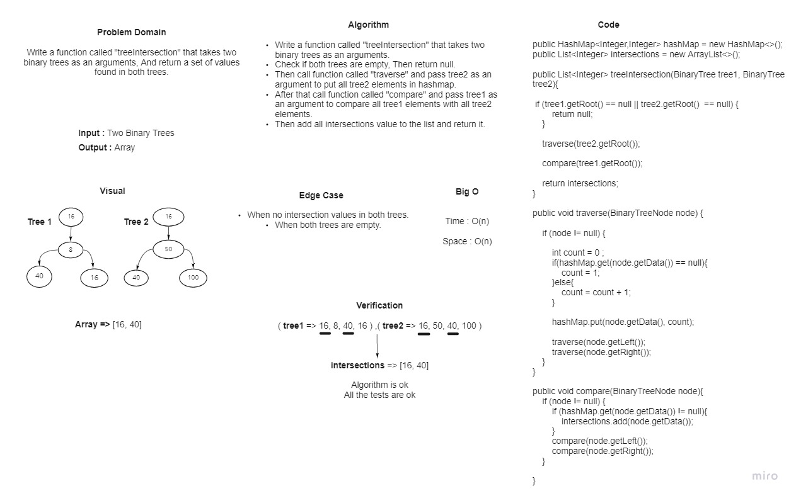

# **30.Hash Tables**

**A hash table** is a data structure that implements a hash table array, which maps keys to values.

## **Challenge**

* **We asked to implement hashtable by Creating 2 classes with their basic methods :**

1. **Node class**
2. **HashTable Class**

## **Approach & Efficiency**

* **add** - space complexity is O(n), time is 0(n).

* **get** - average time and space are O(1). Worst time is O(n).

* **contains** - average time and space are O(1). Worst time is O(n).

* **hash** - average time and space are O(1). Worst time is O(n).

## **API**

* **add**
  * Arguments: key, value.
  * Returns: nothing.
  * This method should hash the key, and add   the key and value pair to the table, handling collisions as needed.

* **get**
  * Arguments: key.
  * Returns: Value associated with that key in the table.

* **contains**
  * Arguments: key.
  * Returns: Boolean, indicating if the key exists in the table already.

* **hash**
  * Arguments: key.
  * Returns: Index in the collection for that key.

-------------------------------------------------------------------------------------------------------------

# **31.Hashmap Repeated-Word**

## **Challenge Summary**

Write a function that accepted a string parameter which finds the first word to occur more than once in a string and return a string.

## **Whiteboard Process**

## **Approach & Efficiency**

* Time : O(n^2)

* Space : O(n)

-------------------------------------------------------------------------------------------------------------

# **32.Tree Intersection**

## **Challenge Summary**

Create a method that takes two binary trees as a parameter and return an array of nodes that are similar in two trees.
## **Whiteboard Process**

## **Approach & Efficiency**

* Time : O(n)

* Space : O(n)
