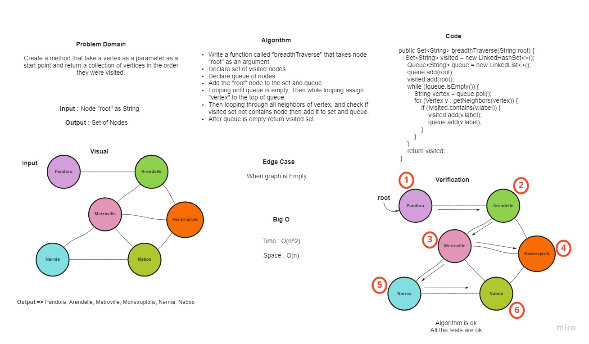
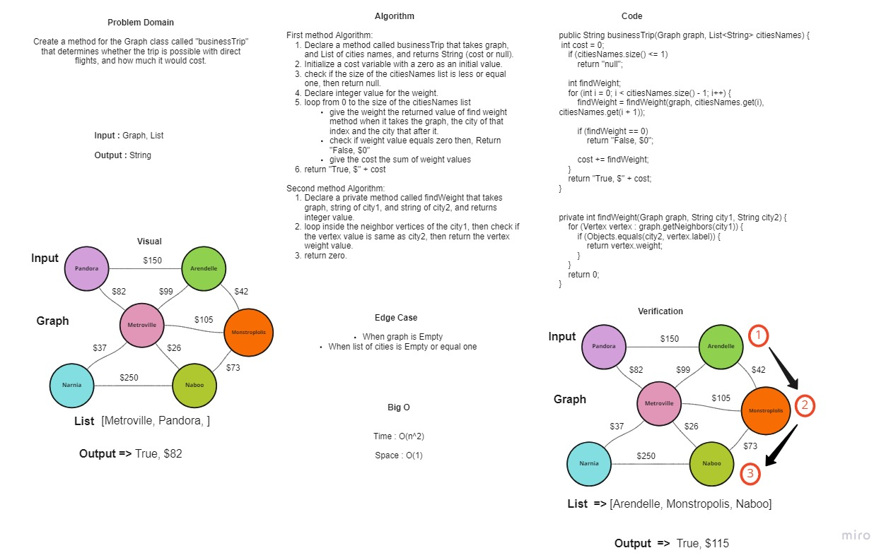
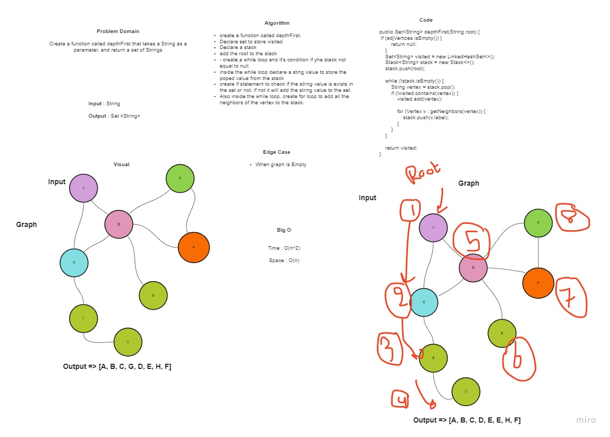

# **35.Graph**

**A Graph** is a non-linear data structure consisting of nodes and edges. The nodes are sometimes also referred to as vertices and the edges are lines or arcs that connect any two nodes in the graph.

## **Challenge**

* **We asked to implement Graph by Creating 2 classes with their basic methods :**

1. **Vertex"Node" class**
2. **Graph Class**

## **Approach & Efficiency**

* **addNode**
  * Time: O(1)
  * Space: O(1)

* **addEdge**
  * Time: O(1)
  * Space: O(1)

* **getNodes**
  * Time: O(1)
  * Space: O(n)

* **getNeighbors**
  * Time: O(1)
  * Space: O(n)

* **size**
  * Time: O(n)
  * Space: O(1)

## **API**

1. `addNode(String data)`: This method adds a vertex to the graph and it accepts `String` parameter for the value of the vertex.

2. `addEdge(String data1, String data2)`: This method adds a new edge between two Vertices in the graph and it accepts two `String` parameters, The parameters are vertices that will add the edge between each other.

3. `getNodes()`: This method returns all of the nodes in the graph as a collection.

4. `getNeighbors(String data)`: This method returns all the connections of the required vertex as a list.

5. `size()`: This method to get the number of all vertices in the graph.

---------------------------------------------------------------------------------------------------------------
# **36.Graph Breadth First**

Create a static method which returns a Set of the Graph vertices in their breadth from a specified root.
## **Challenge Summary**

Create a method that take a vertex as a parameter as a start point and return a collection of vertices in the order they were visited.

## **Whiteboard Process**

## **Approach & Efficiency**

* Time: O(n^2)

* Space: O(n)

---------------------------------------------------------------------------------------------------------------

# **37.Graph Business Trip**

This challenge to check the weight of edge between the connected vertices.

## **Challenge Summary**

Create a method give us the cost of the trip between cities.

## **Whiteboard Process**

## **Approach & Efficiency**

* Time: O(n^2)

* Space: O(1)

---------------------------------------------------------------------------------------------------------------

# **38.Graph Depth First**

Create a static method which returns a Set of the Graph vertices in their Depth from a specified root.

## **Challenge Summary**

Create a method that take a vertex as a parameter as a start point and return a collection of vertices in the order they were visited.

## **Whiteboard Process**

## **Approach & Efficiency**

* Time: O(n^2)

* Space: O(n)